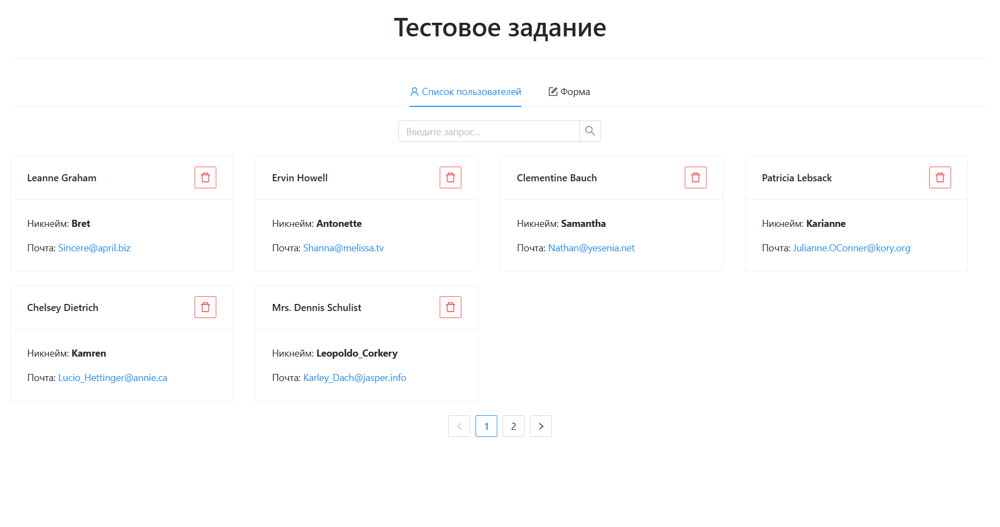

📋 User Manager – Тестовое задание

> Простое Angular-приложение для управления пользователями.
> Реализовано: список пользователей (пагинация, фильтрация), детальная информация пользователей, форма создания/редактирования.
> Используется публичное API JSONPlaceholder, UI‑библиотека NG‑ZORRO, деплой на GitHub Pages.



## 📂 Репозиторий и демо

- **Репозиторий:** [github.com/Sw1ftFox/yadro-test-task](https://github.com/Sw1ftFox/yadro-test-task)

- **Демо:** [sw1ftfox.github.io/yadro-test-task](https://sw1ftfox.github.io/yadro-test-task)

## 📦 Стек технологий

| Категория        | Технологии             |
| ---------------- | ---------------------- |
| Язык / фреймворк | Angular 20, TypeScript |
| UI‑библиотека    | NG‑ZORRO 20            |
| Стейт‑менеджмент | RxJS                   |
| Маршрутизация    | Angular Router         |
| HTTP‑клиент      | Angular HttpClient     |
| Формы            | Angular Reactive Forms |
| Стили            | SCSS / CSS             |
| Деплой           | GitHub Actions         |

## ✨ Основные возможности

- **Список пользователей** – карточки с адаптивной сеткой, пагинация (6 на страницу).
- **Фильтрация** – поиск по имени или email.
- **Детальная информация** – страница пользователя с полной информацией (адрес, компания, контакты).
- **Создание / редактирование** – единая реактивная форма с валидацией.
- **Удаление** – через специальную кнопку в карточке или детальной странице.
- **Адаптивный интерфейс** – корректное отображение на мобильных устройствах.

## 🛠️ Установка и запуск

```bash
git clone https://github.com/Sw1ftFox/yadro-test-task.git
cd yadro-test-task
npm install
npm start
```

## 📂 Структура проекта (основные модули)

```
src/
├── app/
│   ├── components/                # UI‑компоненты
│   │   ├── navigation/            # навигационное меню
│   │   ├── not-found/             # страница 404
│   │   ├── pagination/            # пагинация
│   │   ├── user-detail-info/      # детальная карточка пользователя
│   │   ├── user-form/             # форма создания/редактирования
│   │   ├── user-list/             # список пользователей
│   │   └── user-search/           # поле поиска
│   ├── models/                    # интерфейсы TypeScript
│   │   ├── form.interface.ts      # типы для реактивной формы
│   │   └── user.interface.ts      # типы связанные с пользователем
│   ├── services/                  # бизнес‑логика и работа с API
│   │   ├── api/                   # HTTP‑запросы к JSONPlaceholder
│   │   │   └── api-service.ts
│   │   └── user-facade/           # фасадный сервис
│   │       └── user-facade-service.ts
│   ├── utils/                     # вспомогательные функции
│   │   └── searchUser.ts          # фильтрация пользователей по имени/email
│   ├── app.config.ts              # провайдеры
│   ├── app.routes.ts              # маршрутизация
│   └── app.ts                     # корневой компонент
├── styles.scss                    # глобальные стили
├── index.html
└── main.ts                        # точка входа
```
